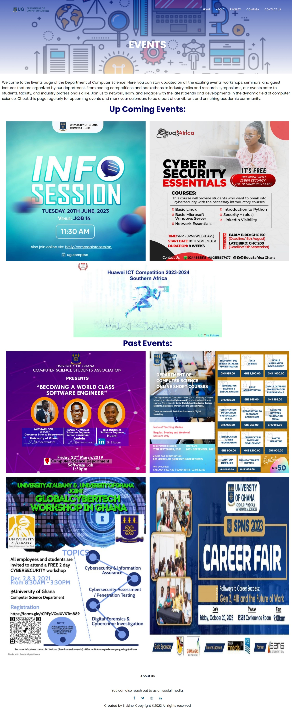

# DCIT_205_IA

Introduction:  
Welcome to the Department Website Project! This project was developed by Mensah Erskine (11293368) as part of a student IA. The purpose of this project is to create a simple and informative website for the department of computer science.

The department website serves as an online platform to provide information about the department, its programs, faculty, and other relevant details. It is designed to be user-friendly and to showcase the department's activities.

Technologies used include:
- HTML5
- CSS3
- JavaScript

# How to clone and set up the project

Installation:  
To run this project locally, follow these steps:
1. Open git bash
2. Locate file directory where you want to store the remote repository by using the cd command.
3. Open git hub and navigate to code and copy url.
4. To clone the repository for this project: 
In git bash, type: `git clone https://github.com/ErskineMensah/DCIT_205_IA_11293368.git` and press enter on the keyboard
5. Open the project in your preferred code editor.
6. Launch the `index.html` file in a web browser.

# Student Information:

Mensah Erskine  
11293368  
emensah699@st.ug.edu.gh  

# Screenshot of pages:

The index.html: is the main page which links and enables navigations to different pages. You can have access for all the pages from here.
.jpeg)

AboutPage.html: Detailed information about the department, our community, vision, and values.

COMPSSAPage.html:this portion contains every thing you need to know about the Computer Science  Students Association.

ContactPage.html: gives you access and the opportunity to communicate with the department.

EventsPage.html: content on all events happening at the department.

FacultyPage.html: contains information about the staff present at the department.

GetToKnowUspage.html: get insight into what we do here at the department of computer science.

New&AnnouncementPage.html: Updates on technology news and a list of important announcements.

ShortProgrammesPage.html: view our ShortProgrammes courses here.

ShortProgrammesRegistration.html: sign up on this page.

UnderGraduatePage.html: view our UnderGraduatePage courses here.

GraduatePage.html: view our GraduatePage courses here.

# What I learnt from this project

In my opinion, working on this project has been educative, fun, stressful, time consuming and at times frustrating. The positives I picked from the completion of this project was exposure and development of my knowledge in html, css and javascript.

I had the opportunity to discover new tags in html such as the section, navigation, script, form and div tags. Some of which were crucial to the page layout.

For the css aspect, I studied some new ways oof styling and modifying html elements. One notable part of the application of css is the Display style which gives options such as: block, inline, inline-block, flex, grid, none and others which helped out in the positioning and layout of all the pages.

For the javascript aspect, I came across ways of creating personalized functions and implementing them using the script tag.

For the git and github aspects, the videos and resources aided in my understanding of some commands and functionalities of git and github.

For the responsive design aspect, I studied ways to create websites that provide optimal viewing and interaction experience across a wide range of devices and screen sizes. The goal was to ensure that the website looks and functions well on desktops, laptops, tablets, and smartphones. I made use of components such as media queries, flexible images and media, viewport meta tag, css flexbox and grid.

The main challenge I encounter while working on this project had to do with Structuring all elements on the website to appeal aesthetically to the user.  Using css to attain this design was really stressful and required intensive studies with practical applications.

## Contact

If you have any questions or suggestions, please contact Mensah Erskine via emensah669@st.ug.edu.gh

Thank you for visiting our department website!